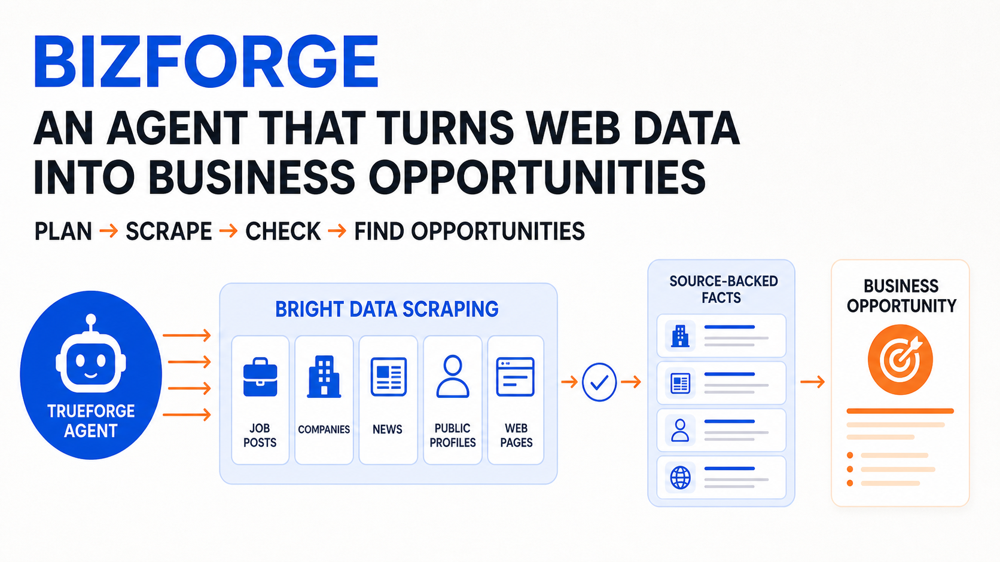
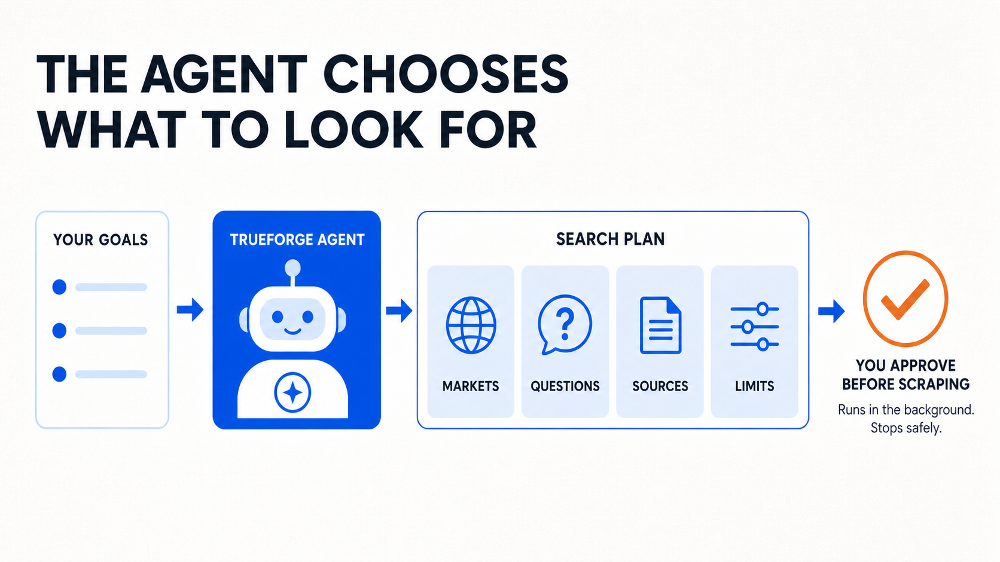
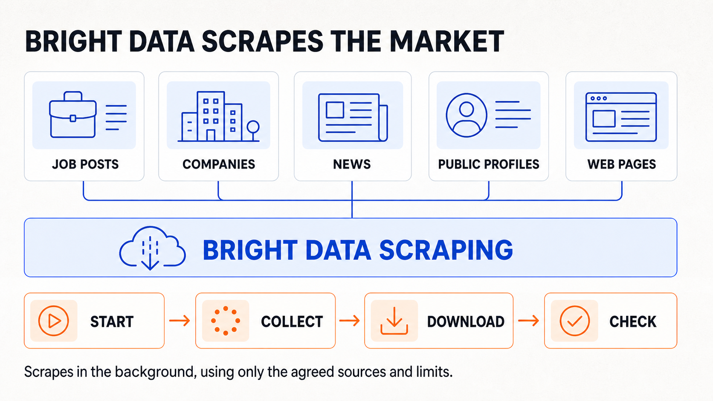
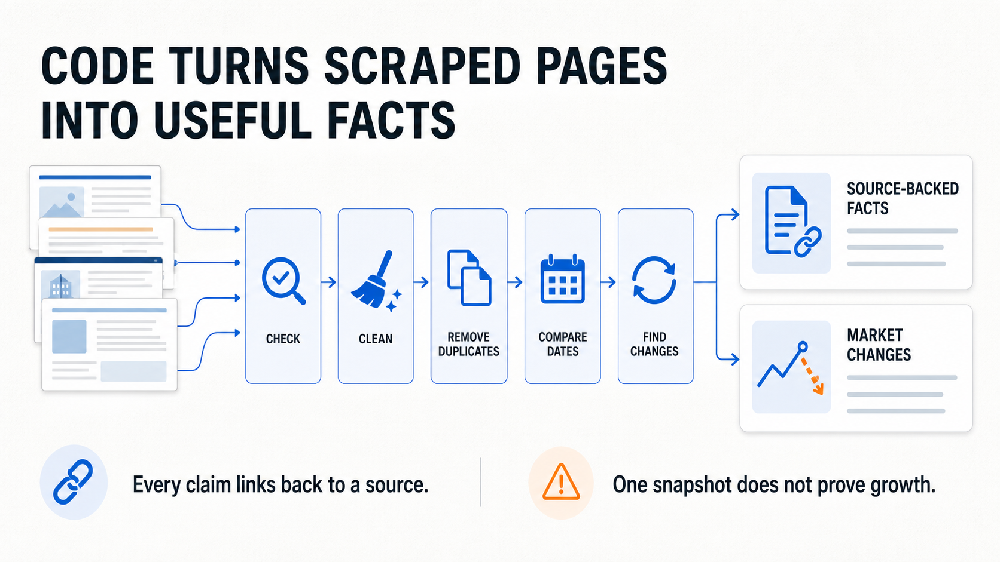
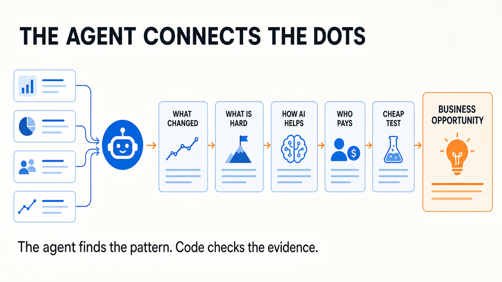

# BizForge

BizForge is an evidence-backed opportunity research agent. It looks for real market
scarcities that AI may make abundant, identifies the buyer who benefits, and ranks the
resulting business hypotheses against a founder's capabilities and constraints.

This repository is a hackathon project built on
[TrueForge](https://github.com/truefoundry/trueforge), Bright Data, and OpenAI.

## Agent and scraping flow

BizForge uses a TrueForge agent to choose the research, Bright Data to scrape agreed public
sources, and ordinary TypeScript to check the results before the agent proposes an opportunity.
The Bright Data ingestion adapter is the next implementation slice.











## Workflow

BizForge is designed as three stages:

1. **Founder setup** — an interactive TrueForge agent produces a confirmed founder profile.
2. **Batch research** — a headless, resumable pipeline collects evidence, computes market
   signals, maps value chains and validates scarcity-removal hypotheses.
3. **Exploration** — an interactive TrueForge agent explains, challenges and reranks a
   completed research bundle.

Stage 2 is the engineering core. TrueForge owns planning and agent judgment; deterministic
TypeScript owns collection reliability, provenance, state transitions, trend math and claim
validation.

## Current scope

The current implementation establishes the contracts and safety rails for all three stages:

- four consent-first Founder Setup skills for Stage 1;
- strict runtime-validated domain schemas;
- an explicit research-run state machine;
- evidence-linked claims and opportunity dossiers;
- deterministic opportunity scoring;
- research-bundle validation;
- a loopback Streamable HTTP MCP server shared by all three stages;
- a persistent SQLite data-store adapter for founder setup, evidence and research bundles;
- three read-only exploration skills for evidence, Generative UI charts and skeptical review;
- provider ports, plus a headless TrueForge session/turn adapter; the Bright Data adapter follows
  in the ingestion PR;
- fail-closed handling for indeterminate, non-idempotent TrueForge session creation;
- automated formatting, linting, type checking, tests and builds.

See [the architecture](docs/architecture.md) for the planned runtime boundaries.

## Development

Requirements:

- Node.js 24.13 or newer (BizForge uses the built-in `node:sqlite` API)
- npm 10 or newer

```bash
npm install
cp .env.example .env
npm run check
```

`npm run check` runs formatting verification, linting, TypeScript checks, unit tests and the
production build. Tests use isolated temporary databases or prepared records and do not require
API keys.

### Local MCP server

The MCP endpoint is intentionally local and unauthenticated. It binds to `127.0.0.1:8791`,
applies localhost Host/Origin validation, and exposes `/mcp` plus `/healthz`:

```bash
npm run build
npm run mcp:start
```

Both MCP scripts load `.env` when it exists. Values already present in the process environment
take precedence, so one-off overrides such as the command below continue to work.

The live MCP always uses persistent SQLite. Unless configured otherwise, it creates
`.data/bizforge.sqlite` under the directory where the process starts. To select another local
file, set `BIZFORGE_DB_PATH`; relative paths are resolved from that same working directory:

```bash
BIZFORGE_DB_PATH=/private/path/bizforge.sqlite npm run mcp:serve
```

### Local profile-data privacy

The SQLite file can contain founder profile answers, consent records and minimized evidence
extracts. Keep it on a trusted local volume, do not sync or commit it, and protect backups with
the same care. BizForge creates the database with owner-only file permissions and `.data/` is
gitignored. `bizforge://evidence/{evidenceId}` resolves a stored minimized canonical evidence
extract; it does not expose the original provider payload. Deleting a founder through MCP removes
controllable records from SQLite, but separately managed backups and TrueForge conversation
transcripts follow their own retention policies.

## Credentials

Local credentials belong only in `.env`:

- `OPENAI_API_KEY`
- `BRIGHT_DATA_API_KEY`
- `DAYTONA_API_KEY`
- optional TrueForge connection settings
- `BIZFORGE_DB_PATH` (local SQLite path, default `.data/bizforge.sqlite`)

Never commit `.env`, SQLite/WAL files, raw provider responses containing personal data, or runtime
artifacts. Only `.env.example` is tracked, and it contains names rather than values.

## Review workflow

Every substantive change is developed on a branch and reviewed through a GitHub pull request.
Qodo is configured to review state-transition correctness, retry and idempotency behavior,
provenance, prompt-injection isolation, privacy boundaries and secret-safe logging. Accepted
findings receive regression tests before a follow-up review.

## License

[MIT](LICENSE)
